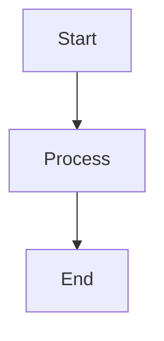

# Midil Kit Documentation

This is the official documentation site for Midil Kit, built with [Docusaurus 3](https://docusaurus.io/).

## 🚀 Getting Started

### Prerequisites

- **Node.js** >= 18.0
- **npm** or **yarn**

### Installation

```bash
# Install dependencies
npm install

# Or using yarn
yarn install
```

### Development

Start the development server:

```bash
npm start
# or
yarn start
```

This will start the documentation site at `http://localhost:3000` with hot reloading.

### Building

Build the static site for production:

```bash
npm run build
# or
yarn build
```

The static files will be generated in the `build` directory.

### Serving Production Build

After building, you can serve the production build locally:

```bash
npm run serve
# or
yarn serve
```

## 📁 Documentation Structure

The documentation follows a modular structure that mirrors the Midil Kit codebase:

```
docs/
├── docs/                    # Documentation content
│   ├── introduction.md      # Landing page
│   ├── getting-started.md   # Installation and setup guide
│   ├── auth/               # Authentication guides
│   │   └── overview.md
│   └── modules/            # Module-specific documentation
│       ├── auth.md         # midil.auth module
│       ├── event.md        # midil.event module
│       ├── http.md         # midil.http_client module
│       └── extensions.md   # midil.midilapi module
├── static/                 # Static assets (images, files)
│   └── img/
├── src/                    # Custom components and styles
│   └── css/
│       └── custom.css
├── docusaurus.config.js    # Docusaurus configuration
├── sidebars.js            # Sidebar navigation structure
└── package.json           # Dependencies and scripts
```

## 📝 Writing Documentation

### Adding New Pages

1. Create a new `.md` or `.mdx` file in the `docs/` directory
2. Add frontmatter at the top:

```markdown
---
sidebar_position: 1
title: Your Page Title
description: Brief description for SEO
---

# Your Page Title

Content goes here...
```

3. Add the page to `sidebars.js` in the appropriate section

### Markdown Features

#### Code Blocks

Use syntax highlighting with language specification:

````markdown
```python showLineNumbers
def hello_world():
    print("Hello, Midil Kit!")
```
````

#### Admonitions

Use callouts to highlight important information:

```markdown
:::tip Pro Tip
This is a helpful tip!
:::

:::info Additional Context
This provides extra information.
:::

:::caution Be Careful
This warns about potential issues.
:::

:::warning Critical
This highlights critical information.
:::
```

#### Mermaid Diagrams

Create diagrams using Mermaid syntax:

````markdown

````

#### Tabs

Create tabbed content:

```markdown
import Tabs from '@theme/Tabs';
import TabItem from '@theme/TabItem';

<Tabs>
  <TabItem value="python" label="Python" default>
    
    ```python
    print("Hello")
    ```
  
  </TabItem>
  <TabItem value="bash" label="Bash">
    
    ```bash
    echo "Hello"
    ```
  
  </TabItem>
</Tabs>
```

#### Images

Add images with zoom capability:

```markdown


<!-- Disable zoom for specific images -->
{.not-zoom}
```

## 🎨 Customization

### Theming

Customize colors and styles in `src/css/custom.css`:

- Primary colors (light/dark mode)
- Typography
- Component styling
- Responsive design

### Navigation

Edit `docusaurus.config.js` to customize:

- Navbar items
- Footer links
- Site metadata
- Plugins and themes

### Sidebar

Edit `sidebars.js` to organize documentation:

- Add new categories
- Reorder pages
- Create nested structures

## 🔍 Search

The documentation includes local search powered by [@easyops-cn/docusaurus-search-local](https://github.com/easyops-cn/docusaurus-search-local).

Search automatically indexes:
- All documentation pages
- Headings and content
- Code blocks (optionally)

## 📦 Features

This documentation site includes:

- ✅ **Local Search** - Fast client-side search
- ✅ **Image Zoom** - Click images to zoom
- ✅ **Live Code Blocks** - Interactive code examples
- ✅ **Mermaid Diagrams** - Visual diagrams and flowcharts
- ✅ **Dark Mode** - Auto-switching dark/light theme
- ✅ **Responsive Design** - Mobile-friendly layout
- ✅ **Code Highlighting** - Syntax highlighting for Python, Bash, YAML, JSON, and more
- ✅ **Table of Contents** - Auto-generated TOC for each page
- ✅ **Last Updated** - Shows last update time for pages
- ✅ **Edit on GitHub** - Direct links to edit documentation

## 🚢 Deployment

### GitHub Pages

To deploy to GitHub Pages:

```bash
GIT_USER=<Your GitHub username> npm run deploy
```

### Other Platforms

The `build` directory contains static files that can be deployed to:

- Vercel
- Netlify
- AWS S3 + CloudFront
- Any static hosting service

## 🤝 Contributing

When contributing to the documentation:

1. **Follow the style guide** - Maintain consistency with existing docs
2. **Test locally** - Run `npm start` to preview changes
3. **Check for broken links** - Run `npm run build` to catch broken links
4. **Use proper formatting** - Follow Markdown best practices
5. **Add examples** - Include code examples where helpful
6. **Update sidebars** - Add new pages to `sidebars.js`

## 📚 Resources

- [Docusaurus Documentation](https://docusaurus.io/docs)
- [Markdown Guide](https://www.markdownguide.org/)
- [Mermaid Documentation](https://mermaid.js.org/)
- [Midil Kit Repository](https://github.com/midil-labs/midil-kit)

## 🐛 Issues

If you find issues with the documentation:

1. Check if the issue is with the docs or the library itself
2. Open an issue on [GitHub](https://github.com/midil-labs/midil-kit/issues)
3. Use the `documentation` label for docs-specific issues

## 📄 License

The documentation is part of the Midil Kit project and follows the same license.

---

Built with ❤️ by the Midil.io team using [Docusaurus](https://docusaurus.io/).