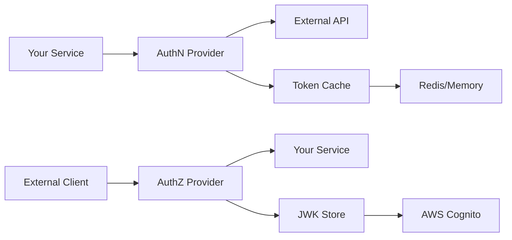

# Authentication Overview

This section provides comprehensive documentation for the authentication and authorization system in Midil Kit. The auth module follows clean architecture principles with clear separation between authentication (who you are) and authorization (what you can access).

## Quick Navigation

### Core Concepts
- [**Interfaces**](./interfaces) - Abstract interfaces for AuthN and AuthZ providers
- [**Cognito Integration**](./cognito) - AWS Cognito implementation details
- [**Examples**](./examples) - Real-world usage patterns and code examples

### Key Features

**🔐 Dual Interface Design**
- `AuthNProvider` for outbound authentication (your service calling APIs)
- `AuthZProvider` for inbound authorization (validating incoming tokens)

**☁️ AWS Cognito Ready**
- Client credentials flow for machine-to-machine authentication
- JWT token validation with automatic key rotation support
- Built-in token caching and refresh mechanisms

**🔌 Extensible Architecture**
- Plugin any authentication provider through abstract interfaces
- Easy to test with mock implementations
- Type-safe with full Pydantic model validation

**⚡ FastAPI Integration**
- Drop-in authentication middleware
- Dependency injection for route-level auth
- Automatic error handling with JSON:API compliant responses

## Architecture Overview



### Authentication Flow (Outbound)

1. **Token Acquisition**: Your service requests access token from provider
2. **Token Caching**: Token is cached until near expiration
3. **Header Generation**: Authentication headers created for outbound requests
4. **Automatic Refresh**: Tokens refreshed automatically when expired

### Authorization Flow (Inbound)

1. **Token Extraction**: JWT token extracted from Authorization header
2. **Signature Verification**: Token signature validated using JWK
3. **Claims Parsing**: Token claims extracted and validated
4. **Context Creation**: Authentication context made available to handlers

## Getting Started

### Basic Setup

```python
from midil.auth.cognito import (
    CognitoClientCredentialsAuthenticator,
    CognitoJWTAuthorizer
)

# For making authenticated requests to other services
auth_client = CognitoClientCredentialsAuthenticator(
    client_id="your-client-id",
    client_secret="your-client-secret",
    cognito_domain="your-domain.auth.us-east-1.amazoncognito.com"
)

# For validating incoming requests to your service
jwt_authorizer = CognitoJWTAuthorizer(
    user_pool_id="us-east-1_abcd1234",
    region="us-east-1"
)
```

### FastAPI Integration

```python
from fastapi import FastAPI, Depends
from midil.midilapi.middleware.auth_middleware import CognitoAuthMiddleware

app = FastAPI()

# Add authentication middleware
app.add_middleware(
    CognitoAuthMiddleware,
    user_pool_id="us-east-1_abcd1234",
    region="us-east-1"
)

# Use authentication in routes
@app.get("/protected")
async def protected_route(request):
    auth = request.state.auth  # Authentication context
    return {"user_id": auth.claims.sub}
```

## Common Patterns

### Service-to-Service Authentication

```python
from midil.http_client import HttpClient

# Create HTTP client with authentication
http_client = HttpClient(
    base_url=URL("https://api.partner.com"),
    auth_client=auth_client
)

# Make authenticated request
response = await http_client.send_request("GET", "/data")
# Authorization header automatically included
```

### User Authentication

```python
# Validate user token
try:
    claims = await jwt_authorizer.verify(user_token)
    user_id = claims.sub
    user_email = claims.email
    user_groups = claims.get("cognito:groups", [])
except AuthenticationError:
    # Handle invalid token
    pass
```

### Custom Authentication Provider

```python
from midil.auth.interfaces.authenticator import AuthNProvider

class ApiKeyAuthenticator(AuthNProvider):
    def __init__(self, api_key: str):
        self.api_key = api_key

    async def get_token(self) -> AuthNToken:
        return AuthNToken(
            access_token=self.api_key,
            token_type="ApiKey",
            expires_in=86400,
            issued_at=datetime.utcnow()
        )

    async def get_headers(self) -> AuthNHeaders:
        return AuthNHeaders(
            authorization=f"ApiKey {self.api_key}"
        )
```

## Security Best Practices

### Token Management
- Never log access tokens or secrets
- Use short-lived tokens with refresh capability
- Implement proper token rotation in production
- Store secrets securely (environment variables, AWS Secrets Manager)

### Access Control
- Implement least-privilege access patterns
- Use group-based authorization where possible
- Validate token audience and issuer claims
- Monitor authentication failures and unusual patterns

### Production Considerations
- Always use HTTPS in production
- Configure proper CORS policies
- Set up monitoring and alerting for auth failures
- Use connection pooling for token validation requests

## Configuration

### Environment Variables

```bash
# Cognito Configuration
COGNITO_USER_POOL_ID=us-east-1_abcd1234
COGNITO_CLIENT_ID=your-client-id
COGNITO_CLIENT_SECRET=your-client-secret
COGNITO_DOMAIN=your-domain.auth.us-east-1.amazoncognito.com
COGNITO_REGION=us-east-1

# Optional: Token caching
TOKEN_CACHE_TTL=3600
TOKEN_REFRESH_THRESHOLD=300

# Optional: JWK caching
JWK_CACHE_TTL=3600
JWK_REFRESH_INTERVAL=1800
```

### Programmatic Configuration

```python
from midil.auth.config import AuthConfig

config = AuthConfig(
    cognito_user_pool_id="us-east-1_abcd1234",
    cognito_client_id="your-client-id",
    cognito_client_secret="your-client-secret",
    cognito_domain="your-domain.auth.us-east-1.amazoncognito.com",
    token_cache_ttl=3600,
    jwk_cache_ttl=3600
)
```

## Troubleshooting

### Common Issues

**Token Validation Failures**
- Verify user pool ID and region are correct
- Check that token hasn't expired
- Ensure JWK endpoint is accessible

**Authentication Timeouts**
- Configure appropriate HTTP timeouts
- Use connection pooling for better performance
- Consider token pre-fetching for high-traffic applications

**Authorization Errors**
- Verify token audience matches your client ID
- Check that required scopes are granted
- Ensure user has necessary group memberships

### Debug Mode

```python
import logging

# Enable debug logging for authentication
logging.getLogger("midil.auth").setLevel(logging.DEBUG)
logging.getLogger("httpx").setLevel(logging.DEBUG)

# This will show detailed auth flow information
```

## What's Next?

- **[Interfaces](./interfaces)** - Deep dive into the authentication interfaces
- **[Cognito Integration](./cognito)** - Complete Cognito implementation guide
- **[Examples](./examples)** - Real-world code examples and patterns
- **[FastAPI Extensions](../extensions/overview)** - FastAPI middleware and dependencies
- **[HTTP Client](../http/overview)** - Using authentication with HTTP client
