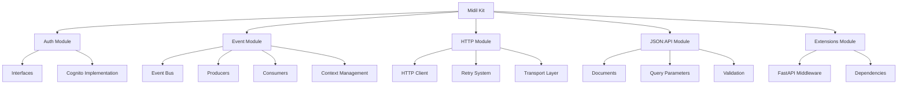

# Midil Kit Documentation

Welcome to **Midil Kit**, a comprehensive Python SDK for backend systems development at [midil.io](https://midil.io). This library provides a rich set of tools for building modern, scalable backend applications with support for authentication, event handling, HTTP clients, and JSON:API compliance.

## 🎯 Overview

Midil Kit is designed around **SOLID principles** and **well-architected design patterns** to provide a modular, type-safe, and extensible foundation for Python backend development. The library follows a clean architecture approach with clear separation of concerns and abstract interfaces that allow for easy testing and customization.

## ✨ Key Features

### 🔐 Authentication & Authorization
- **JWT Authorization**: Comprehensive JWT token verification and validation
- **AWS Cognito Integration**: Ready-to-use Cognito client credentials flow and JWT authorizer
- **Pluggable Auth Providers**: Abstract interfaces for custom authentication implementations
- **FastAPI Middleware**: Built-in authentication middleware for FastAPI applications

### 📡 Event System
- **Event Dispatching**: Abstract event dispatcher with polling and AWS integrations
- **SQS Consumer**: AWS SQS message consumption with automatic retry and context handling
- **Event Scheduling**: AWS EventBridge integration and periodic task scheduling
- **Event Context**: Distributed tracing and context management for events

### 🌐 HTTP Client
- **Enhanced HTTP Client**: HTTPX-based client with authentication integration
- **Retry Logic**: Configurable retry strategies with exponential backoff and jitter
- **Transport Layer**: Custom transport with comprehensive error handling
- **Auth Integration**: Seamless integration with authentication providers

### 📋 JSON:API Compliance
- **Document Creation**: Full JSON:API compliant document creation and validation
- **Resource Management**: Type-safe resource objects with relationships
- **Query Parameters**: Parsing and validation of JSON:API query parameters (sort, include, pagination)
- **Error Handling**: Standardized JSON:API error document creation

### 🚀 Framework Extensions
- **FastAPI Integration**: Authentication middleware and JSON:API dependencies
- **Type Safety**: Full type hints throughout with Pydantic models
- **Async Support**: Native async/await support across all components

## 🏗️ Architecture

Midil Kit follows a modular architecture designed around core principles:



### Design Principles

- **Type Safety**: Comprehensive type hints using Pydantic models
- **Async First**: Native async/await support throughout
- **Pluggable**: Abstract interfaces for custom implementations
- **Framework Agnostic**: Core functionality independent of web frameworks
- **AWS Native**: First-class support for AWS services
- **SOLID Principles**: Single responsibility, open-closed, Liskov substitution, interface segregation, and dependency inversion

## 🚀 Quick Start

Get started with Midil Kit in just a few minutes:

1. **Install the package**:
   ```bash
   pip install midil-kit
   ```

2. **Basic usage example**:
   ```python
   from midil.auth.cognito import CognitoClientCredentialsAuthenticator
   from midil.http_client import HttpClient
   from httpx import URL

   # Set up authentication
   auth_client = CognitoClientCredentialsAuthenticator(
       client_id="your-client-id",
       client_secret="your-client-secret",
       cognito_domain="your-domain.auth.region.amazoncognito.com"
   )

   # Create HTTP client with auth
   http_client = HttpClient(
       auth_client=auth_client,
       base_url=URL("https://api.example.com")
   )

   # Make authenticated request
   response = await http_client.send_request("GET", "/users")
   ```

## 📚 What's Next?

Explore the documentation:

- [**Getting Started**](./getting-started): Installation, setup, and first steps
- [**Core Modules**](./modules/auth): Deep dive into each module
- [**API Reference**](./auth/overview): Complete API documentation
- [**Examples**](./auth/examples): Real-world usage examples

## 🤝 Contributing

We welcome contributions! See our [Contributing Guide](./development/contributing) to get started.

## 📄 License

This project is licensed under the Apache License 2.0. See the [LICENSE](https://github.com/midil-labs/midil-kit/blob/main/LICENSE) file for details.

---

Built with ❤️ by the [Midil.io](https://midil.io) team for the Python backend development community.
