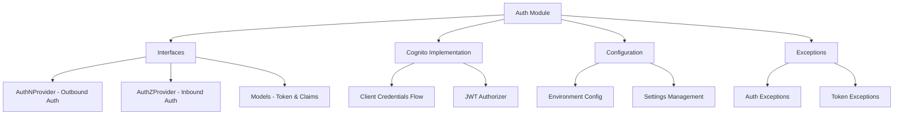

# Authentication Module

The Authentication module (`midil.auth`) provides a comprehensive foundation for authentication and authorization in backend systems. It follows the **separation of concerns** principle by distinguishing between **authentication** (who you are) and **authorization** (what you can access).

## Overview



## Core Architecture

### Design Principles

The authentication module is built around several key principles:

- **Interface Segregation**: Separate interfaces for authentication (outbound) and authorization (inbound)
- **Single Responsibility**: Each component has a single, well-defined purpose
- **Dependency Inversion**: Depend on abstractions, not concretions
- **Open/Closed**: Easy to extend with new providers without modifying existing code

### Authentication vs Authorization

| Aspect | Authentication (`AuthNProvider`) | Authorization (`AuthZProvider`) |
|--------|--------------------------------|--------------------------------|
| **Purpose** | Acquire tokens for outbound requests | Validate tokens for inbound requests |
| **Use Case** | Your service calling external APIs | External services calling your API |
| **Direction** | Outbound | Inbound |
| **Responsibility** | Get access tokens | Verify and decode tokens |

## Interfaces

### AuthNProvider (Authentication)

For services that need to make authenticated outbound requests:

```python
from abc import ABC, abstractmethod
from midil.auth.interfaces.models import AuthNToken, AuthNHeaders

class AuthNProvider(ABC):
    """
    Abstract base class for authentication clients that acquire and manage access tokens.

    Use this when your service needs to make authenticated requests to external APIs.
    """

    @abstractmethod
    async def get_token(self) -> AuthNToken:
        """Get an access token for authentication"""
        pass

    @abstractmethod
    async def get_headers(self) -> AuthNHeaders:
        """Get authentication headers for HTTP requests"""
        pass
```

### AuthZProvider (Authorization)

For services that need to validate incoming authentication tokens:

```python
from abc import ABC, abstractmethod
from midil.auth.interfaces.models import AuthZTokenClaims

class AuthZProvider(ABC):
    """
    Abstract base class for token validation and authorization.

    Use this when your service receives requests that need token validation.
    """

    @abstractmethod
    async def verify(self, token: str) -> AuthZTokenClaims:
        """Verify and decode an authentication token"""
        pass
```

## Data Models

### AuthNToken

Represents an authentication token with expiration handling:

```python
from datetime import datetime
from pydantic import BaseModel

class AuthNToken(BaseModel):
    access_token: str
    token_type: str = "Bearer"
    expires_in: int  # seconds
    issued_at: datetime

    @property
    def is_expired(self) -> bool:
        """Check if token is expired"""
        return datetime.utcnow() > self.expires_at

    @property
    def expires_at(self) -> datetime:
        """Get token expiration time"""
        return self.issued_at + timedelta(seconds=self.expires_in)
```

### AuthNHeaders

HTTP headers for authenticated requests:

```python
class AuthNHeaders(BaseModel):
    authorization: str
    content_type: str = "application/json"

    def to_dict(self) -> dict[str, str]:
        """Convert to dictionary for HTTP requests"""
        return {
            "Authorization": self.authorization,
            "Content-Type": self.content_type
        }
```

### AuthZTokenClaims

Token claims extracted from validated JWT tokens:

```python
class AuthZTokenClaims(BaseModel):
    sub: str  # Subject (user ID)
    iss: str  # Issuer
    aud: str  # Audience
    exp: int  # Expiration time
    iat: int  # Issued at
    email: str | None = None
    groups: list[str] = []

    @property
    def is_expired(self) -> bool:
        """Check if token claims indicate expiration"""
        return datetime.utcnow().timestamp() > self.exp
```

## AWS Cognito Implementation

### Client Credentials Flow (AuthN)

For machine-to-machine authentication:

```python
from midil.auth.cognito import CognitoClientCredentialsAuthenticator

# Initialize the authenticator
auth_client = CognitoClientCredentialsAuthenticator(
    client_id="your-client-id",
    client_secret="your-client-secret",
    cognito_domain="your-domain.auth.us-east-1.amazoncognito.com",
    scope="openid profile email"  # Optional
)

# Get access token
token = await auth_client.get_token()
print(f"Token expires at: {token.expires_at}")

# Get authentication headers
headers = await auth_client.get_headers()
print(f"Authorization: {headers.authorization}")
```

### JWT Authorizer (AuthZ)

For validating incoming JWT tokens:

```python
from midil.auth.cognito import CognitoJWTAuthorizer

# Initialize the authorizer
jwt_authorizer = CognitoJWTAuthorizer(
    user_pool_id="us-east-1_abcd1234",
    region="us-east-1"
)

# Verify incoming token
try:
    claims = await jwt_authorizer.verify("eyJ0eXAiOiJKV1QiLCJhbGciOiJSUzI1NiIsImtpZCI6...")
    print(f"User: {claims.sub}")
    print(f"Groups: {claims.groups}")
except AuthenticationError as e:
    print(f"Token validation failed: {e}")
```

## Configuration

### Environment Variables

The auth module supports configuration through environment variables:

```bash
# Cognito Configuration
COGNITO_USER_POOL_ID=us-east-1_abcd1234
COGNITO_CLIENT_ID=your-client-id
COGNITO_CLIENT_SECRET=your-client-secret
COGNITO_DOMAIN=your-domain.auth.us-east-1.amazoncognito.com
COGNITO_REGION=us-east-1

# Optional: Default scope for client credentials
COGNITO_DEFAULT_SCOPE=openid profile email
```

### Programmatic Configuration

```python
from midil.auth.config import AuthConfig

config = AuthConfig(
    cognito_user_pool_id="us-east-1_abcd1234",
    cognito_client_id="your-client-id",
    cognito_client_secret="your-client-secret",
    cognito_domain="your-domain.auth.us-east-1.amazoncognito.com",
    cognito_region="us-east-1"
)

# Use config with authenticator
auth_client = CognitoClientCredentialsAuthenticator(
    client_id=config.cognito_client_id,
    client_secret=config.cognito_client_secret,
    cognito_domain=config.cognito_domain
)
```

## Exception Handling

The auth module provides specific exceptions for different error scenarios:

```python
from midil.auth.exceptions import (
    AuthenticationError,
    TokenExpiredError,
    TokenValidationError,
    ConfigurationError
)

try:
    token = await auth_client.get_token()
except AuthenticationError as e:
    # Handle authentication failure
    logger.error(f"Authentication failed: {e}")
except TokenExpiredError as e:
    # Handle expired token
    logger.warning(f"Token expired: {e}")
except ConfigurationError as e:
    # Handle configuration issues
    logger.error(f"Configuration error: {e}")
```

## Advanced Usage

### Token Caching and Refresh

The Cognito implementation includes automatic token caching and refresh:

```python
# Token is automatically cached and refreshed when needed
auth_client = CognitoClientCredentialsAuthenticator(
    client_id="your-client-id",
    client_secret="your-client-secret",
    cognito_domain="your-domain.auth.us-east-1.amazoncognito.com"
)

# First call - fetches new token
token1 = await auth_client.get_token()

# Second call - returns cached token (if not expired)
token2 = await auth_client.get_token()

# Third call - automatically refreshes if expired
await asyncio.sleep(3600)  # Wait for expiration
token3 = await auth_client.get_token()  # Fresh token
```

### Custom Token Validation

Extend the JWT authorizer for custom validation logic:

```python
from midil.auth.cognito import CognitoJWTAuthorizer
from midil.auth.interfaces.models import AuthZTokenClaims

class CustomJWTAuthorizer(CognitoJWTAuthorizer):
    async def verify(self, token: str) -> AuthZTokenClaims:
        # Use parent validation
        claims = await super().verify(token)

        # Add custom validation
        if "admin" not in claims.groups:
            raise AuthenticationError("Admin access required")

        # Add custom claims
        claims.custom_field = "custom_value"

        return claims
```

### Integration with Dependency Injection

Use with FastAPI dependency injection:

```python
from fastapi import Depends, HTTPException
from midil.auth.cognito import CognitoJWTAuthorizer

jwt_authorizer = CognitoJWTAuthorizer(
    user_pool_id="us-east-1_abcd1234",
    region="us-east-1"
)

async def get_current_user(
    authorization: str = Header(...),
    authorizer: CognitoJWTAuthorizer = Depends(lambda: jwt_authorizer)
) -> AuthZTokenClaims:
    try:
        # Extract token from Authorization header
        token = authorization.replace("Bearer ", "")
        return await authorizer.verify(token)
    except AuthenticationError:
        raise HTTPException(status_code=401, detail="Invalid token")

@app.get("/protected")
async def protected_endpoint(current_user: AuthZTokenClaims = Depends(get_current_user)):
    return {"user_id": current_user.sub, "groups": current_user.groups}
```

## Testing

### Mocking Authentication

```python
import pytest
from unittest.mock import AsyncMock
from midil.auth.interfaces.authenticator import AuthNProvider
from midil.auth.interfaces.models import AuthNToken, AuthNHeaders

class MockAuthNProvider(AuthNProvider):
    async def get_token(self) -> AuthNToken:
        return AuthNToken(
            access_token="mock-token",
            token_type="Bearer",
            expires_in=3600,
            issued_at=datetime.utcnow()
        )

    async def get_headers(self) -> AuthNHeaders:
        return AuthNHeaders(authorization="Bearer mock-token")

@pytest.fixture
def mock_auth_provider():
    return MockAuthNProvider()

async def test_authenticated_request(mock_auth_provider):
    headers = await mock_auth_provider.get_headers()
    assert headers.authorization == "Bearer mock-token"
```

## Best Practices

### Security

1. **Never log tokens**: Avoid logging access tokens or secrets
2. **Use HTTPS**: Always use HTTPS in production
3. **Token rotation**: Implement proper token rotation strategies
4. **Scope limitation**: Use minimal required scopes

### Performance

1. **Token caching**: Leverage built-in token caching
2. **Connection pooling**: Reuse HTTP connections for token requests
3. **Async operations**: Use async/await throughout

### Error Handling

1. **Graceful degradation**: Handle auth failures gracefully
2. **Retry logic**: Implement retry for transient failures
3. **Monitoring**: Monitor authentication success/failure rates

## Next Steps

- [**Cognito Implementation**](../auth/cognito): Deep dive into AWS Cognito integration
- [**FastAPI Integration**](../extensions/middleware): Use auth middleware with FastAPI
- [**HTTP Client Integration**](../http/client): Combine with HTTP client for authenticated requests
- [**Examples**](../auth/examples): See real-world usage examples
