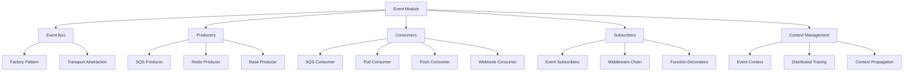

# Event System Module

The Event System module (`midil.event`) provides a comprehensive foundation for building event-driven applications. It supports multiple transport mechanisms, provides distributed context management, and follows clean architecture principles with pluggable components.

## Overview



## Core Architecture

### Design Principles

The event system is built around several key architectural patterns:

- **Factory Pattern**: Centralized creation of producers and consumers
- **Strategy Pattern**: Pluggable transport mechanisms (SQS, Redis, etc.)
- **Observer Pattern**: Event subscription and notification
- **Middleware Pattern**: Composable event processing pipeline
- **Context Pattern**: Distributed tracing and context propagation

## Event Bus

The `EventBus` serves as the central orchestrator for event-driven systems:

```python
from midil.event import EventBus

# Initialize event bus
event_bus = EventBus()

# Register subscribers
@event_bus.subscriber("user.created")
async def handle_user_created(event_data: dict):
    print(f"User created: {event_data}")

@event_bus.subscriber("order.placed")
async def handle_order_placed(event_data: dict):
    print(f"Order placed: {event_data}")

# Publish events
await event_bus.publish("user.created", {
    "user_id": "123",
    "email": "john@example.com"
})
```

### Event Bus Factory

The factory pattern enables pluggable transport mechanisms:

```python
from midil.event.config import EventConfig, EventProducerType, EventConsumerType

# SQS Configuration
sqs_config = EventConfig(
    producer=EventProducerType.SQS,
    consumer=EventConsumerType.SQS,
    producer_config={
        "queue_url": "https://sqs.us-east-1.amazonaws.com/123456789012/events",
        "region_name": "us-east-1"
    },
    consumer_config={
        "queue_url": "https://sqs.us-east-1.amazonaws.com/123456789012/events",
        "region_name": "us-east-1"
    }
)

# Redis Configuration
redis_config = EventConfig(
    producer=EventProducerType.REDIS,
    consumer=EventConsumerType.PULL,  # Redis uses pull consumer
    producer_config={
        "redis_url": "redis://localhost:6379",
        "stream_name": "events"
    }
)

# Create event bus with specific transport
sqs_event_bus = EventBus(config=sqs_config)
redis_event_bus = EventBus(config=redis_config)
```

## Producers

Producers are responsible for publishing events to various transport mechanisms.

### Base Producer Interface

```python
from abc import ABC, abstractmethod
from typing import Any, Dict

class EventProducer(ABC):
    """Abstract base class for event producers"""

    @abstractmethod
    async def publish(self, event_type: str, data: Dict[str, Any]) -> None:
        """Publish an event"""
        pass

    @abstractmethod
    async def close(self) -> None:
        """Close producer connections"""
        pass
```

### SQS Producer

For AWS SQS-based event publishing:

```python
from midil.event import SQSProducer, SQSProducerEventConfig

# Configure SQS producer
config = SQSProducerEventConfig(
    queue_url="https://sqs.us-east-1.amazonaws.com/123456789012/events",
    region_name="us-east-1"
)

# Create and use producer
producer = SQSProducer(config)

# Publish events
await producer.publish("user.created", {
    "user_id": "123",
    "email": "john@example.com",
    "timestamp": "2025-01-01T12:00:00Z"
})

# Publish with message attributes
await producer.publish(
    event_type="order.placed",
    data={
        "order_id": "ord_123",
        "user_id": "123",
        "amount": 99.99
    },
    message_attributes={
        "source": "web-app",
        "version": "1.0"
    }
)

# Clean up
await producer.close()
```

### Redis Producer

For Redis Streams-based event publishing:

```python
from midil.event import RedisProducer, RedisProducerEventConfig

# Configure Redis producer
config = RedisProducerEventConfig(
    redis_url="redis://localhost:6379",
    stream_name="events",
    max_len=10000  # Optional: limit stream length
)

# Create and use producer
producer = RedisProducer(config)

# Publish events
await producer.publish("user.updated", {
    "user_id": "123",
    "changes": {"email": "new@example.com"}
})

await producer.close()
```

## Consumers

Consumers process events from various transport mechanisms using different consumption strategies.

### Consumer Strategies

#### Pull Consumer

For actively polling transport mechanisms:

```python
from midil.event import PullEventConsumer, PullEventConsumerConfig

# Configure pull consumer
config = PullEventConsumerConfig(
    poll_interval=1.0,  # Poll every second
    batch_size=10,      # Process 10 messages at once
    max_workers=5       # Use 5 worker threads
)

# Create consumer
consumer = PullEventConsumer(config)

# Register event handlers
@consumer.handler("user.created")
async def handle_user_created(message):
    print(f"Processing user creation: {message.data}")

@consumer.handler("order.placed")
async def handle_order_placed(message):
    print(f"Processing order: {message.data}")

# Start consuming
await consumer.start()
```

#### Push Consumer

For webhook-style event consumption:

```python
from midil.event import PushEventConsumer, PushEventConsumerConfig

# Configure push consumer (webhook server)
config = PushEventConsumerConfig(
    host="0.0.0.0",
    port=8080,
    path="/webhooks/events"
)

consumer = PushEventConsumer(config)

# Register handlers
@consumer.handler("payment.completed")
async def handle_payment(message):
    print(f"Payment completed: {message.data}")

# Start webhook server
await consumer.start()
```

### SQS Consumer

Specialized consumer for AWS SQS:

```python
from midil.event import SQSConsumer, SQSConsumerEventConfig

# Configure SQS consumer
config = SQSConsumerEventConfig(
    queue_url="https://sqs.us-east-1.amazonaws.com/123456789012/events",
    region_name="us-east-1",
    max_messages=10,        # Receive up to 10 messages per batch
    wait_time_seconds=20,   # Long polling
    visibility_timeout=300  # 5 minutes to process message
)

# Create consumer
consumer = SQSConsumer(config)

# Process messages with error handling
@consumer.handler("user.created")
async def handle_user_created(message):
    try:
        user_data = message.data
        # Process user creation
        print(f"Creating user: {user_data}")

        # Acknowledge successful processing
        await message.ack()

    except Exception as e:
        print(f"Error processing user creation: {e}")
        # Reject message for retry
        await message.nack()

# Start consuming with graceful shutdown
try:
    await consumer.start()
except KeyboardInterrupt:
    await consumer.stop()
```

## Subscribers and Middlewares

### Event Subscribers

Subscribers provide a clean way to register event handlers:

```python
from midil.event import EventSubscriber, FunctionSubscriber

class UserEventSubscriber(EventSubscriber):
    event_types = ["user.created", "user.updated", "user.deleted"]

    async def handle(self, event_type: str, data: dict):
        if event_type == "user.created":
            await self.handle_user_created(data)
        elif event_type == "user.updated":
            await self.handle_user_updated(data)
        elif event_type == "user.deleted":
            await self.handle_user_deleted(data)

    async def handle_user_created(self, data: dict):
        print(f"User created: {data}")

    async def handle_user_updated(self, data: dict):
        print(f"User updated: {data}")

    async def handle_user_deleted(self, data: dict):
        print(f"User deleted: {data}")

# Register subscriber
subscriber = UserEventSubscriber()
event_bus.register_subscriber(subscriber)

# Function-based subscribers
@FunctionSubscriber(["order.placed", "order.cancelled"])
async def handle_order_events(event_type: str, data: dict):
    if event_type == "order.placed":
        await process_order(data)
    elif event_type == "order.cancelled":
        await cancel_order(data)

event_bus.register_subscriber(handle_order_events)
```

### Middleware

Middleware provides a composable way to add cross-cutting concerns:

```python
from midil.event import SubscriberMiddleware, GroupMiddleware, RetryMiddleware

# Group middleware - for consumer groups
group_middleware = GroupMiddleware(
    group_id="user-service",
    max_concurrent=5
)

# Retry middleware - for automatic retries
retry_middleware = RetryMiddleware(
    max_attempts=3,
    backoff_factor=2.0,
    max_backoff=30.0
)

# Custom logging middleware
class LoggingMiddleware(SubscriberMiddleware):
    async def before(self, event_type: str, data: dict):
        print(f"Processing event: {event_type}")

    async def after(self, event_type: str, data: dict, result: Any):
        print(f"Completed event: {event_type}")

    async def on_error(self, event_type: str, data: dict, error: Exception):
        print(f"Error processing {event_type}: {error}")

# Apply middleware to subscribers
subscriber_with_middleware = UserEventSubscriber()
subscriber_with_middleware.add_middleware(LoggingMiddleware())
subscriber_with_middleware.add_middleware(retry_middleware)
subscriber_with_middleware.add_middleware(group_middleware)

event_bus.register_subscriber(subscriber_with_middleware)
```

## Event Context

The event context system provides distributed tracing and context propagation across event boundaries:

```python
from midil.event import EventContext, event_context, get_current_event

# Using context manager
async def process_user_event(user_data: dict):
    async with event_context(
        event_type="user.created",
        data=user_data,
        correlation_id="req_123",
        metadata={"source": "api", "version": "1.0"}
    ):
        # All operations within this context are traced
        await create_user_profile(user_data)
        await send_welcome_email(user_data)
        await update_analytics(user_data)

# Access current event context
async def create_user_profile(user_data: dict):
    current_event = get_current_event()
    print(f"Processing in context: {current_event.correlation_id}")
    print(f"Event type: {current_event.event_type}")
    print(f"Metadata: {current_event.metadata}")

    # Context is automatically propagated to child operations
    await database.create_user(user_data)
```

### Context Propagation

Context is automatically propagated across async boundaries:

```python
async def handle_user_created(event_data: dict):
    async with event_context("user.created", event_data):
        # Context is available in all child calls
        await create_user_profile(event_data)
        await asyncio.gather(
            send_welcome_email(event_data),
            create_user_preferences(event_data),
            update_user_analytics(event_data)
        )
        # All parallel operations share the same context

async def send_welcome_email(user_data: dict):
    # Context is automatically available
    context = get_current_event()
    print(f"Sending email in context: {context.correlation_id}")

    # Use context for logging and tracing
    logger.info(
        "Sending welcome email",
        extra={
            "correlation_id": context.correlation_id,
            "user_id": user_data["id"],
            "event_type": context.event_type
        }
    )
```

## Best Practices

### Event Design

1. **Event Naming**: Use consistent naming conventions (e.g., `domain.action`)
2. **Event Schema**: Include schema versioning for backward compatibility
3. **Event Size**: Keep events small and focused
4. **Idempotency**: Design events to be idempotent

```python
# Good event structure
event_data = {
    "schema_version": "1.0",
    "event_id": "evt_123",
    "timestamp": "2025-01-01T12:00:00Z",
    "user_id": "user_456",
    "changes": {
        "email": {
            "old": "old@example.com",
            "new": "new@example.com"
        }
    },
    "metadata": {
        "source": "user-service",
        "correlation_id": "req_789"
    }
}
```

## Next Steps

- [**Event Bus Deep Dive**](../event/event-bus): Detailed event bus implementation
- [**Producer Implementations**](../event/producers): All producer types and configurations
- [**Consumer Strategies**](../event/consumers): Different consumer patterns
- [**Context Management**](../event/context): Advanced context and tracing features
- [**Real-world Examples**](../event/examples): Complete application examples
