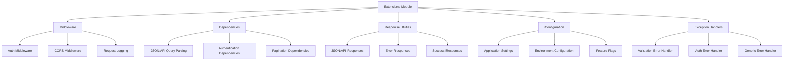

# FastAPI Extensions Module

The FastAPI Extensions module (`midil.midilapi`) provides seamless integration between Midil Kit and FastAPI applications. It includes authentication middleware, JSON:API dependencies, response utilities, and configuration management specifically designed for FastAPI applications.

## Overview



## Core Architecture

### Design Principles

The FastAPI extensions follow these principles:

- **Framework Integration**: Deep FastAPI integration following FastAPI patterns
- **Dependency Injection**: Leverages FastAPI's dependency injection system
- **Type Safety**: Full type hints and validation using Pydantic
- **Middleware Pipeline**: Composable middleware for cross-cutting concerns
- **Error Handling**: Consistent error responses following JSON:API standard

## Authentication Middleware

### Cognito Auth Middleware

The Cognito authentication middleware automatically validates JWT tokens on protected routes:

```python
from fastapi import FastAPI
from midil.midilapi.middleware.auth_middleware import CognitoAuthMiddleware

app = FastAPI()

# Add Cognito authentication middleware
app.add_middleware(
    CognitoAuthMiddleware,
    user_pool_id="us-east-1_abcd1234",
    region="us-east-1",
    excluded_paths=["/health", "/docs", "/openapi.json"]
)

@app.get("/protected")
async def protected_endpoint(request):
    # Access authenticated user
    auth_context = request.state.auth
    return {
        "user_id": auth_context.claims.sub,
        "email": auth_context.claims.email,
        "groups": auth_context.claims.get("cognito:groups", [])
    }
```

## JSON:API Dependencies

FastAPI dependencies for parsing JSON:API query parameters:

### Sort Parameter

```python
from midil.midilapi.dependencies.jsonapi import parse_sort
from midil.jsonapi import Sort
from fastapi import Depends

@app.get("/users")
async def list_users(sort: Sort = Depends(parse_sort)):
    # sort parameter automatically parsed
    # ?sort=name,-created_at,+email

    query = db.session.query(User)

    # Apply sorting
    for field in sort.fields:
        column = getattr(User, field.name)
        if field.direction == SortDirection.DESC:
            query = query.order_by(column.desc())
        else:
            query = query.order_by(column.asc())

    users = query.all()
    return {"data": [serialize_user(user) for user in users]}
```

### Authentication Dependencies

```python
from fastapi import Depends, HTTPException
from midil.midilapi.dependencies.auth import get_current_user
from midil.auth.interfaces.models import AuthZTokenClaims

async def get_current_user(request) -> AuthZTokenClaims:
    """Dependency to get the current authenticated user"""
    if not hasattr(request.state, 'auth'):
        raise HTTPException(status_code=401, detail="Authentication required")

    return request.state.auth.claims

@app.get("/me")
async def get_user_profile(current_user: AuthZTokenClaims = Depends(get_current_user)):
    return {
        "user_id": current_user.sub,
        "email": current_user.email,
        "groups": current_user.get("cognito:groups", [])
    }
```

## Best Practices

### Dependency Organization

```python
# dependencies/auth.py
async def get_current_user(request) -> AuthZTokenClaims:
    """Get current authenticated user"""
    if not hasattr(request.state, 'auth'):
        raise HTTPException(status_code=401, detail="Authentication required")
    return request.state.auth.claims

async def get_current_user_optional(request) -> AuthZTokenClaims | None:
    """Get current user if authenticated, otherwise None"""
    if hasattr(request.state, 'auth'):
        return request.state.auth.claims
    return None

# dependencies/jsonapi.py
from midil.jsonapi import Sort, Include, PaginationParams, QueryParams

async def parse_sort(sort: str | None = Query(None)) -> Sort | None:
    """Parse sort query parameter"""
    if sort:
        return Sort.from_string(sort)
    return None

async def parse_include(include: str | None = Query(None)) -> Include | None:
    """Parse include query parameter"""
    if include:
        return Include.from_string(include)
    return None
```

### Service Layer Integration

```python
# services.py
from typing import List, Optional
from midil.jsonapi import QueryParams

class UserService:
    def __init__(self, db_session, event_bus, cache_manager):
        self.db = db_session
        self.events = event_bus
        self.cache = cache_manager

    async def list_users(
        self,
        query_params: QueryParams,
        current_user: AuthZTokenClaims
    ) -> tuple[List[User], int]:
        """List users with filtering, sorting, and pagination"""

        # Check cache first
        cache_key = self.cache.generate_cache_key("users", query_params, current_user.sub)
        cached_result = await self.cache.get_cached_response(cache_key)
        if cached_result:
            return cached_result

        # Build query
        query = self.db.query(User)

        # Apply access control
        if not self._user_can_list_all_users(current_user):
            query = query.filter(User.id == current_user.sub)

        # Apply filters
        if query_params.filter:
            query = self._apply_filters(query, query_params.filter)

        # Get total count before pagination
        total = query.count()

        # Apply sorting
        if query_params.sort:
            query = self._apply_sorting(query, query_params.sort)

        # Apply pagination
        offset = (query_params.page_number - 1) * query_params.page_size
        query = query.offset(offset).limit(query_params.page_size)

        users = query.all()

        # Cache result
        await self.cache.cache_response(cache_key, (users, total))

        return users, total
```

## Next Steps

- [**Middleware Deep Dive**](../extensions/middleware): Advanced middleware patterns
- [**Dependencies Guide**](../extensions/dependencies): Comprehensive dependency injection
- [**Response Utilities**](../extensions/responses): Advanced response handling
- [**Testing Strategies**](../extensions/testing): Complete testing approaches
- [**Production Deployment**](../extensions/deployment): Production-ready configurations
