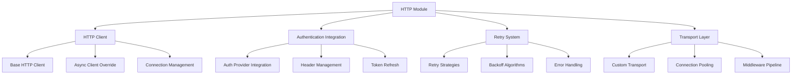

# HTTP Client Module

The HTTP Client module (`midil.http_client`) provides an enhanced HTTP client built on top of HTTPX with authentication integration, configurable retry strategies, and custom transport layer capabilities. It's designed to be the backbone for reliable service-to-service communication.

## Overview



## Core Architecture

### Design Principles

The HTTP client is built around several key principles:

- **Separation of Concerns**: Clear separation between client, authentication, retry logic, and transport
- **Composition over Inheritance**: Build functionality through composition of components
- **Configurable Retry**: Pluggable retry strategies with various backoff algorithms
- **Authentication Abstraction**: Works with any `AuthNProvider` implementation
- **Transport Flexibility**: Custom transport layer for advanced use cases

## HTTP Client

The main `HttpClient` class provides a high-level interface for making HTTP requests:

```python
from midil.http_client import HttpClient
from midil.auth.cognito import CognitoClientCredentialsAuthenticator
from httpx import URL

# Create authenticated HTTP client
auth_client = CognitoClientCredentialsAuthenticator(
    client_id="your-client-id",
    client_secret="your-client-secret",
    cognito_domain="your-domain.auth.us-east-1.amazoncognito.com"
)

http_client = HttpClient(
    base_url=URL("https://api.example.com"),
    auth_client=auth_client
)

# Make requests
response = await http_client.send_request(
    method="GET",
    url="/users",
    params={"limit": 10, "offset": 0}
)

print(f"Status: {response.status_code}")
print(f"Data: {response.json()}")
```

### Basic Usage

```python
# GET request
response = await http_client.send_request("GET", "/users/123")
user_data = response.json()

# POST request with data
response = await http_client.send_request(
    method="POST",
    url="/users",
    data={
        "name": "John Doe",
        "email": "john@example.com"
    }
)

# PUT request with JSON
response = await http_client.send_request(
    method="PUT",
    url="/users/123",
    json={
        "name": "John Smith",
        "email": "john.smith@example.com"
    }
)

# DELETE request
response = await http_client.send_request("DELETE", "/users/123")

# Request with custom headers
response = await http_client.send_request(
    method="GET",
    url="/protected-resource",
    headers={"X-Custom-Header": "custom-value"}
)
```

### Request Parameters

The `send_request` method supports all standard HTTP parameters:

```python
response = await http_client.send_request(
    method="POST",
    url="/api/data",
    params={"filter": "active"},           # Query parameters
    data={"key": "value"},                 # Form data
    json={"name": "John"},                 # JSON body
    headers={"X-Version": "1.0"},          # Custom headers
    cookies={"session": "abc123"},         # Cookies
    timeout=30.0,                          # Request timeout
    files={"upload": open("file.txt", "rb")}  # File uploads
)
```

## Authentication Integration

The HTTP client seamlessly integrates with any `AuthNProvider`:

### Automatic Token Management

```python
# Token is automatically acquired and added to headers
response = await http_client.send_request("GET", "/protected")

# If token expires, it's automatically refreshed
await asyncio.sleep(3600)  # Wait for token expiration
response = await http_client.send_request("GET", "/protected")  # Fresh token used
```

### Header Resolution

The client intelligently merges headers from multiple sources:

```python
# Base headers (set during client creation)
http_client = HttpClient(
    base_url=URL("https://api.example.com"),
    headers={"X-Client-Version": "1.0"},
    auth_client=auth_client
)

# Request-specific headers
response = await http_client.send_request(
    method="GET",
    url="/data",
    headers={"X-Request-ID": "req_123"}
)

# Final headers will include:
# - X-Client-Version: 1.0 (base)
# - Authorization: Bearer <token> (auth)
# - X-Request-ID: req_123 (request)
# - Content-Type: application/json (auth default)
```

### Custom Authentication

You can use any authentication provider:

```python
from midil.auth.interfaces.authenticator import AuthNProvider
from midil.auth.interfaces.models import AuthNToken, AuthNHeaders

class CustomAuthProvider(AuthNProvider):
    def __init__(self, api_key: str):
        self.api_key = api_key

    async def get_token(self) -> AuthNToken:
        return AuthNToken(
            access_token=self.api_key,
            token_type="ApiKey",
            expires_in=86400,
            issued_at=datetime.utcnow()
        )

    async def get_headers(self) -> AuthNHeaders:
        return AuthNHeaders(
            authorization=f"ApiKey {self.api_key}",
            content_type="application/json"
        )

# Use custom auth
custom_auth = CustomAuthProvider("your-api-key")
http_client = HttpClient(
    base_url=URL("https://api.example.com"),
    auth_client=custom_auth
)
```

## Retry System

The HTTP client includes a sophisticated retry system with configurable strategies and backoff algorithms.

### Default Retry Behavior

```python
from midil.http_client import HttpClient

# Client with default retry (3 attempts, exponential backoff)
http_client = HttpClient(
    base_url=URL("https://api.example.com"),
    auth_client=auth_client
)

# Automatically retries on:
# - Connection errors
# - Timeout errors
# - 5xx server errors
# - 429 rate limit errors
response = await http_client.send_request("GET", "/unreliable-endpoint")
```

### Custom Retry Configuration

```python
from midil.http_client.overrides.retry.strategies import DefaultRetryStrategy
from midil.http_client.overrides.retry.backoffs import ExponentialBackoffWithJitter

# Custom retry strategy
retry_strategy = DefaultRetryStrategy(
    max_attempts=5,                    # Try up to 5 times
    backoff_factor=2.0,               # Double delay each retry
    max_backoff=60.0,                 # Max 60 seconds between retries
    jitter=True,                      # Add random jitter
    retry_on_status_codes=[429, 502, 503, 504],  # Retry on these codes
    retry_on_exceptions=[ConnectionError, TimeoutError]  # Retry on these exceptions
)

# Create client with custom retry
http_client = HttpClient(
    base_url=URL("https://api.example.com"),
    auth_client=auth_client,
    retry_strategy=retry_strategy
)
```

### Backoff Strategies

#### Exponential Backoff

```python
from midil.http_client.overrides.retry.backoffs import ExponentialBackoff

backoff = ExponentialBackoff(
    base_delay=1.0,      # Start with 1 second
    multiplier=2.0,      # Double each time
    max_delay=60.0       # Cap at 60 seconds
)

# Retry delays: 1s, 2s, 4s, 8s, 16s, 32s, 60s, 60s, ...
```

#### Exponential Backoff with Jitter

```python
from midil.http_client.overrides.retry.backoffs import ExponentialBackoffWithJitter

backoff = ExponentialBackoffWithJitter(
    base_delay=1.0,
    multiplier=2.0,
    max_delay=60.0,
    jitter_factor=0.1    # Add up to 10% random jitter
)

# Retry delays: ~1s, ~2s, ~4s, ~8s (with random variation)
```

#### Fixed Delay Backoff

```python
from midil.http_client.overrides.retry.backoffs import FixedDelayBackoff

backoff = FixedDelayBackoff(delay=5.0)  # Always wait 5 seconds
```

### Conditional Retry

```python
from midil.http_client.overrides.retry.strategies import ConditionalRetryStrategy

def should_retry(response, exception):
    # Custom retry logic
    if exception:
        return isinstance(exception, (ConnectionError, TimeoutError))

    if response:
        # Retry on server errors, but not on client errors
        return 500 <= response.status_code < 600

    return False

retry_strategy = ConditionalRetryStrategy(
    max_attempts=3,
    backoff=ExponentialBackoff(base_delay=1.0),
    should_retry=should_retry
)
```

### Retry Events and Callbacks

```python
async def on_retry(attempt: int, response, exception, delay: float):
    print(f"Retry attempt {attempt} after {delay}s")
    if response:
        print(f"Status: {response.status_code}")
    if exception:
        print(f"Exception: {exception}")

retry_strategy = DefaultRetryStrategy(
    max_attempts=5,
    on_retry=on_retry  # Called before each retry
)
```

## Transport Layer

The HTTP client uses a custom transport layer for advanced features:

### Retry Transport

```python
from midil.http_client.overrides.retry.transport import RetryTransport
from midil.http_client.overrides.async_client import MidilAsyncClient

# Create transport with retry capability
transport = RetryTransport(
    retry_strategy=retry_strategy
)

# Create client with custom transport
client = MidilAsyncClient(
    transport=transport,
    base_url="https://api.example.com"
)
```

### Custom Transport

```python
import httpx
from typing import Iterator

class LoggingTransport(httpx.AsyncHTTPTransport):
    async def ahandle_async_request(self, request: httpx.Request) -> httpx.Response:
        print(f"Request: {request.method} {request.url}")

        response = await super().ahandle_async_request(request)

        print(f"Response: {response.status_code}")
        return response

# Use custom transport
http_client = HttpClient(
    base_url=URL("https://api.example.com"),
    transport=LoggingTransport()
)
```

### Connection Pooling

```python
from httpx import Limits

# Configure connection limits
limits = Limits(
    max_keepalive_connections=20,  # Keep 20 connections alive
    max_connections=100,           # Max 100 total connections
    keepalive_expiry=30.0         # Keep connections alive for 30s
)

http_client = HttpClient(
    base_url=URL("https://api.example.com"),
    limits=limits
)
```

## Error Handling

### Exception Hierarchy

The HTTP client provides specific exceptions for different error scenarios:

```python
from midil.http_client.overrides.retry.strategies import RetryExhaustedException
from httpx import RequestError, HTTPStatusError

try:
    response = await http_client.send_request("GET", "/api/data")
except RetryExhaustedException as e:
    print(f"All retry attempts failed: {e}")
except HTTPStatusError as e:
    print(f"HTTP error: {e.response.status_code}")
except RequestError as e:
    print(f"Request error: {e}")
```

### Response Validation

```python
# Automatically raise for HTTP error status codes
response = await http_client.send_request(
    method="GET",
    url="/api/data",
    raise_for_status=True  # Raises HTTPStatusError for 4xx/5xx
)

# Custom response validation
def validate_response(response: httpx.Response) -> None:
    if response.status_code == 429:
        retry_after = response.headers.get("Retry-After")
        raise RateLimitError(f"Rate limited. Retry after {retry_after}s")

    response.raise_for_status()

try:
    response = await http_client.send_request("GET", "/api/data")
    validate_response(response)
except RateLimitError as e:
    print(f"Rate limited: {e}")
```

## Advanced Features

### Request Middleware

```python
from typing import Callable
import httpx

class RequestMiddleware:
    def __init__(self, client: HttpClient):
        self.client = client

    async def __call__(
        self,
        request: httpx.Request,
        next_handler: Callable
    ) -> httpx.Response:
        # Pre-request processing
        request.headers["X-Request-Time"] = str(time.time())

        # Execute request
        response = await next_handler(request)

        # Post-request processing
        print(f"Request took {response.elapsed.total_seconds()}s")

        return response

# Apply middleware (pseudo-code - actual implementation may vary)
http_client.add_middleware(RequestMiddleware)
```

### Circuit Breaker Pattern

```python
class CircuitBreakerTransport(httpx.AsyncHTTPTransport):
    def __init__(self, failure_threshold: int = 5, recovery_timeout: float = 60.0):
        super().__init__()
        self.failure_count = 0
        self.failure_threshold = failure_threshold
        self.last_failure_time = None
        self.recovery_timeout = recovery_timeout
        self.state = "CLOSED"  # CLOSED, OPEN, HALF_OPEN

    async def ahandle_async_request(self, request: httpx.Request) -> httpx.Response:
        # Circuit breaker logic
        if self.state == "OPEN":
            if time.time() - self.last_failure_time > self.recovery_timeout:
                self.state = "HALF_OPEN"
            else:
                raise CircuitBreakerOpenError("Circuit breaker is OPEN")

        try:
            response = await super().ahandle_async_request(request)

            # Reset on success
            if response.status_code < 500:
                self.failure_count = 0
                self.state = "CLOSED"

            return response

        except Exception as e:
            self.failure_count += 1
            self.last_failure_time = time.time()

            if self.failure_count >= self.failure_threshold:
                self.state = "OPEN"

            raise
```

### Request/Response Logging

```python
import structlog

logger = structlog.get_logger()

async def log_request_response(
    method: str,
    url: str,
    response: httpx.Response,
    duration: float
):
    logger.info(
        "HTTP request completed",
        method=method,
        url=str(url),
        status_code=response.status_code,
        duration=duration,
        response_size=len(response.content)
    )

# Use with client
start_time = time.time()
response = await http_client.send_request("GET", "/api/data")
duration = time.time() - start_time

await log_request_response("GET", "/api/data", response, duration)
```

## Configuration

### Environment Variables

```bash
# HTTP Client Configuration
HTTP_TIMEOUT=30.0
HTTP_MAX_CONNECTIONS=100
HTTP_MAX_KEEPALIVE_CONNECTIONS=20
HTTP_KEEPALIVE_EXPIRY=30.0

# Retry Configuration
HTTP_MAX_RETRIES=3
HTTP_RETRY_BACKOFF_FACTOR=2.0
HTTP_RETRY_MAX_BACKOFF=60.0
HTTP_RETRY_JITTER=true
```

### Programmatic Configuration

```python
from midil.http_client.config import HttpConfig

config = HttpConfig(
    timeout=30.0,
    max_connections=100,
    max_keepalive_connections=20,
    keepalive_expiry=30.0,
    max_retries=3,
    retry_backoff_factor=2.0,
    retry_max_backoff=60.0,
    retry_jitter=True
)

http_client = HttpClient(
    base_url=URL("https://api.example.com"),
    config=config
)
```

## Testing

### Mocking HTTP Requests

```python
import pytest
from unittest.mock import AsyncMock
import httpx

@pytest.fixture
def mock_http_client():
    client = AsyncMock()
    client.send_request = AsyncMock()
    return client

@pytest.mark.asyncio
async def test_api_call(mock_http_client):
    # Mock response
    mock_response = httpx.Response(
        status_code=200,
        json={"users": [{"id": 1, "name": "John"}]}
    )
    mock_http_client.send_request.return_value = mock_response

    # Test your code
    response = await mock_http_client.send_request("GET", "/users")
    assert response.status_code == 200
    assert response.json()["users"][0]["name"] == "John"
```

### Testing with Real HTTP

```python
import pytest
import httpx

@pytest.mark.asyncio
async def test_real_http_request():
    # Use httpbin.org for testing
    http_client = HttpClient(
        base_url=URL("https://httpbin.org")
    )

    response = await http_client.send_request("GET", "/get")
    assert response.status_code == 200

    data = response.json()
    assert "headers" in data
    assert "url" in data
```

### Testing Retry Logic

```python
@pytest.mark.asyncio
async def test_retry_on_failure():
    call_count = 0

    async def failing_request(*args, **kwargs):
        nonlocal call_count
        call_count += 1
        if call_count < 3:
            raise httpx.ConnectError("Connection failed")
        return httpx.Response(status_code=200)

    # Mock the transport
    with patch.object(http_client, 'send_request', failing_request):
        response = await http_client.send_request("GET", "/test")
        assert response.status_code == 200
        assert call_count == 3  # Failed twice, succeeded on third attempt
```

## Performance Considerations

### Connection Reuse

```python
# Good: Reuse the same client instance
http_client = HttpClient(base_url=URL("https://api.example.com"))

# Make multiple requests with the same client
for i in range(100):
    response = await http_client.send_request("GET", f"/users/{i}")

# Clean up
await http_client.close()
```

### Concurrent Requests

```python
import asyncio

# Concurrent requests with the same client
tasks = []
for user_id in range(1, 101):
    task = http_client.send_request("GET", f"/users/{user_id}")
    tasks.append(task)

# Execute all requests concurrently
responses = await asyncio.gather(*tasks)

print(f"Processed {len(responses)} requests")
```

### Request Batching

```python
async def batch_create_users(users_data: list[dict], batch_size: int = 10):
    """Create users in batches to avoid overwhelming the API"""
    results = []

    for i in range(0, len(users_data), batch_size):
        batch = users_data[i:i + batch_size]

        # Create batch requests
        tasks = [
            http_client.send_request("POST", "/users", json=user_data)
            for user_data in batch
        ]

        # Execute batch
        batch_responses = await asyncio.gather(*tasks, return_exceptions=True)
        results.extend(batch_responses)

        # Rate limiting - wait between batches
        await asyncio.sleep(1.0)

    return results
```

## Best Practices

### Resource Management

```python
# Use context manager for automatic cleanup
async with HttpClient(base_url=URL("https://api.example.com")) as client:
    response = await client.send_request("GET", "/data")
# Client is automatically closed

# Or manually manage lifecycle
http_client = HttpClient(base_url=URL("https://api.example.com"))
try:
    response = await http_client.send_request("GET", "/data")
finally:
    await http_client.close()
```

### Error Handling Strategy

```python
from tenacity import retry, stop_after_attempt, wait_exponential

@retry(
    stop=stop_after_attempt(3),
    wait=wait_exponential(multiplier=1, min=4, max=10)
)
async def robust_api_call(url: str):
    try:
        response = await http_client.send_request("GET", url)
        response.raise_for_status()
        return response.json()
    except httpx.HTTPStatusError as e:
        if e.response.status_code < 500:
            # Don't retry client errors
            raise
        # Retry server errors
        logger.warning(f"Server error {e.response.status_code}, retrying...")
        raise
    except httpx.RequestError as e:
        # Retry network errors
        logger.warning(f"Network error {e}, retrying...")
        raise
```

### Monitoring and Observability

```python
import time
import structlog
from contextlib import asynccontextmanager

logger = structlog.get_logger()

@asynccontextmanager
async def traced_request(method: str, url: str):
    start_time = time.time()

    logger.info("HTTP request started", method=method, url=url)

    try:
        yield
        duration = time.time() - start_time
        logger.info(
            "HTTP request completed",
            method=method,
            url=url,
            duration=duration,
            status="success"
        )
    except Exception as e:
        duration = time.time() - start_time
        logger.error(
            "HTTP request failed",
            method=method,
            url=url,
            duration=duration,
            error=str(e),
            status="error"
        )
        raise

# Usage
async with traced_request("GET", "/users"):
    response = await http_client.send_request("GET", "/users")
```

## Next Steps

- [**Authentication Integration**](../auth/overview): Learn about authentication providers
- [**Retry Strategies**](../http/retry): Deep dive into retry mechanisms
- [**Transport Layer**](../http/client): Advanced transport customization
- [**Real-world Examples**](../http/examples): Complete integration examples
- [**Performance Tuning**](../http/performance): Optimization techniques
